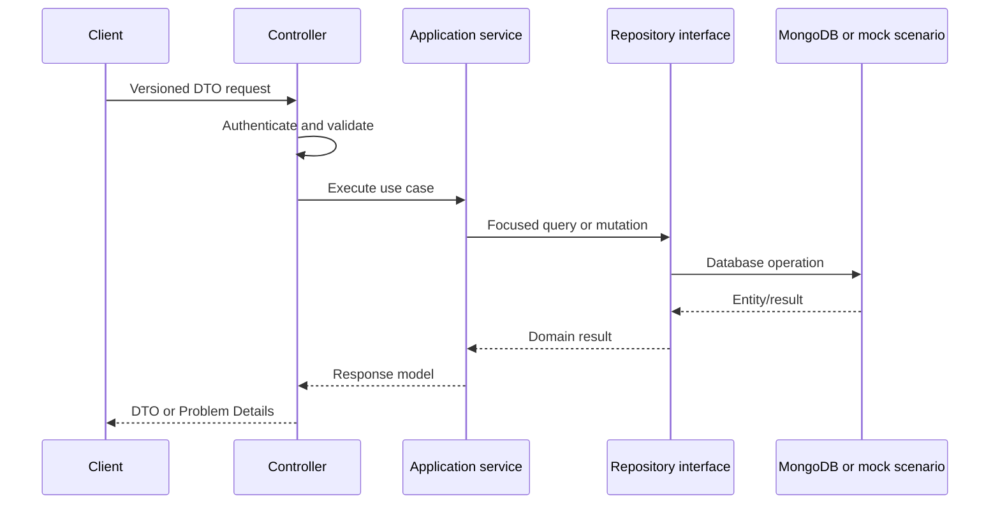

# Backend Architecture

## Composition

Each API is an independent ASP.NET Core host. Startup selects feature flags, configuration providers, authentication, repositories, services, health checks, and middleware.

Production persistence uses Mongo repositories. Development/test may select code-initialized mock repositories through the Domain-owned `IMockScenarioLifecycle`; the default is `Primary`, with named scenario selection from startup configuration and fixture overrides. Mock selection is rejected outside Development or Test, and production registrations continue to construct Mongo/external providers only when mock mode is off.

## Request Flow

Focused services for content, catalog, shop, forms, insights, links, and publishing are now in place. High-impact BackOffice paths (`ShortLinksController`, `VideosController`, `CompilationsController`) are service-based and covered by focused dependency tests; remaining legacy controller migrations proceed incrementally. `DataService` and `IGenericDataService` remain compatibility surfaces for controllers not yet migrated.

## Persistence

### MongoDB

- `BaseRepository<T>` implements generic CRUD.
- Specialized repository interfaces identify collections and feature queries.
- Updates commonly replace complete documents.
- Source-managed Mongo index audit/apply operations exist via BackOffice (`MongoIndexesController`, `MongoIndexOperationsService`) with manifest ownership in `docs/architecture/operations/mongo-index-manifest.phase4.json`.
- `BsonIgnoreExtraElements` supports additive compatibility for many entities.

Full collection materialization and in-memory sorting/filtering bypass Mongo indexes. New repository methods must push predicates, projections, ordering, limits, and atomic updates into MongoDB.

### Mock Data

Current mock repositories are code-initialized, in-memory entity collections loaded through the `IMockScenario`/`PrimaryScenario` abstraction, not JSON files. They support deterministic local behavior without MongoDB. External integrations also need fake implementations so full workflows can run offline. See [Development](development.md).

### SQLite

VideoImporter uses EF Core SQLite for local settings, tenant state, and scheduling. Schema changes require forward and rollback-aware migrations and must preserve existing local databases.

## Authentication And Authorization

### BackOffice

- JWT bearer is the principal scheme.
- JWT bearer remains the authentication scheme for the API, and its handler can read the secure `auth_token` cookie.
- BackOffice browser clients use that cookie only; the SPA does not persist or emit a JWT Bearer token.
- Selected machine endpoints use the `ApiKey` scheme.
- Anonymous access must be explicit and limited to genuine bootstrap/login/submission cases.
- `POST /api/auth/validate` preserves its existing `userId` response and returns normalized, expanded `effectivePermissions`, resolved from direct permissions union active `UserGroup` memberships. This cookie-backed response is the SPA route-guard authority; localStorage is never an authorization source.
- Domain security owns lowercase-invariant, cycle-safe, transitive permission expansion through an explicit mapping. Each declared `<resource>.manage` implies only its reviewed sibling capabilities. Specialized implications are `users.permissions.manage`, `videos.import`/`videos.translate`/`videos.publish`, `forms.responses.view`, and `insights.scan`; `images.manage` has no update leaf and `diagnostics.view` is standalone. Leaves never imply parents, siblings, or other resources.
- `backoffice.manageall` remains the global evaluator/frontend bypass and materializes only `backoffice.access`, not every catalog permission. Persisted parent grants require no migration; auth validation and RBAC summaries expose implied leaves in their existing effective-permission arrays.
- RBAC owns Mongo `UserGroup` documents and the many-to-many relationship represented by user `GroupIds`. Legacy `Role` and `CanAccessBackoffice` data remain readable, with the latter mapped to canonical lowercase `backoffice.access`.
- `backoffice.access` is limited to login and BackOffice entry. RBAC user-list and detail reads require `users.view`; user lifecycle mutations require their corresponding `users.create`, `users.update`, or `users.delete` leaf; group CRUD, memberships, and direct-permission assignments require `users.permissions.manage`. `users.manage` implies these reviewed user-administration capabilities, and `backoffice.manageall` remains the global override.
- `AllowUser` supports `group:` and `perm:` tokens as well as unprefixed OR semantics, and all group/permission comparisons use lowercase invariant normalization.

### Channel tenancy

BackOffice channel selection is explicit. `GET /api/channels` returns the channels accessible to the effective identity; scoped resources require `X-Channel-Id`. The scope middleware returns `400` with `channel_context_required` when the header is missing, and `404` with `channel_context_unavailable` when the channel is unknown or inaccessible. API-key principals are additionally restricted to their persisted `ApiKey.ChannelId`; a binding mismatch is `404`.

The effective impersonated target identity is used for channel ownership and content authorization, while the actor remains the audit and CSRF identity. Administrators can select any channel; normal users are limited to owned channels. Video collaborators retain read access but not mutation access. Compilation management is channel-scoped, but readable videos from other accessible channels may be included. Public compilation URLs are anonymous and globally resolved, so their route and output cache vary by URL rather than administrative channel.

### ServerAPI

- Public endpoints must explicitly allow anonymous access.
- Development fake authentication must require both Development environment and `EnableDev`.
- The free-artifact phase uses an opaque, signed or server-stored anonymous-cart cookie, not a customer identity.
- Future customer authentication receives a distinct scheme/policy and may claim anonymous acquisitions.

### ShortLinks

Redirect resolution is anonymous. Administrative authentication does not belong in this host.

The current shared controller base applies `[Authorize]` across host boundaries. Replace it with host-neutral base behavior and explicit host policies.

## Caching

ServerAPI uses output caching and a memory-cache abstraction. BackOffice mutations coordinate invalidation through `ICrossApiService`.

Rules:

- Register and activate output caching through one coherent setting.
- Cache tags and eviction tags are lowercase invariant constants.
- Internal eviction endpoints require authenticated service-to-service calls and must not be public maintenance GET endpoints.
- Cache failures are logged and observable; mutation success must not silently imply invalidation success.
- Do not cache authorization-sensitive responses without an explicit vary policy.
- Scoped BackOffice responses must vary by the authenticated/effective identity and selected channel; the `X-Channel-Id` header is part of the authorization input. Public compilation URL responses are global and must not be partitioned by an administrative channel header.
- The phase 4 Mongo manifest names the normalized unique compilation URL index and the global short-link code index. Index creation is an approved manual operation, not a startup action; local source review does not prove production deployment.

## Background Work

BackOffice owns Hangfire. Current jobs include YouTube synchronization and a news workflow. Production jobs require durable storage, dashboard protection, idempotency, structured telemetry, safe retries, and feature-controlled scheduling.

## External Integrations

- Azure Blob Storage
- Azure Key Vault
- YouTube data and upload APIs
- Azure Translator/OpenAI/Semantic Kernel
- Discord, Telegram, Facebook, and Pinterest
- Google reCAPTCHA
- Web Push
- A future provider-neutral transactional email service

Every HTTP integration uses `IHttpClientFactory`, typed options, resilience from ServiceDefaults, and a mock/fake where local workflows require it.

## Error Handling

The target API error contract is RFC Problem Details with stable error codes and field validation. Current strings, anonymous objects, direct exceptions, and inconsistent status bodies should migrate endpoint by endpoint.

For channel scope, the current compatibility contract is explicit: missing `X-Channel-Id` is `400`; unknown, inaccessible, or API-key/channel mismatches are `404` to avoid disclosing tenancy. Clients must not deserialize these error envelopes as domain resources.

## Observability

ServiceDefaults configures OpenTelemetry logs, metrics, traces, runtime metrics, ASP.NET instrumentation, and HttpClient instrumentation. Host-specific checks add MongoDB, Blob, jobs, and critical external dependency readiness. Health responses must not include secrets or sensitive connection details.