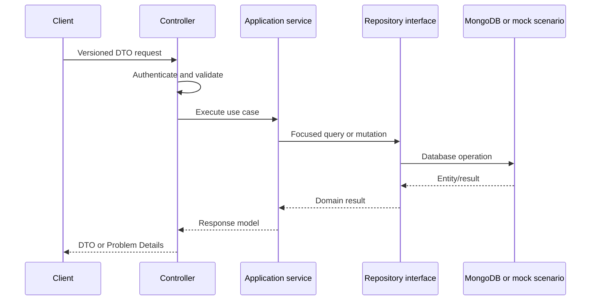

# Backend Architecture

## Composition

Each API is an independent ASP.NET Core host. Startup selects feature flags, configuration providers, authentication, repositories, services, health checks, and middleware.

Production persistence uses Mongo repositories. Development/test may select code-initialized mock repositories through `IMockScenario` and `PrimaryScenario`. Mock selection is rejected outside Development or Test.

## Request Flow

Controllers currently call repositories and broad data facades directly in several areas. The target is focused application services for content, catalog, shop, forms, insights, links, and publishing.

## Persistence

### MongoDB

- `BaseRepository<T>` implements generic CRUD.
- Specialized repository interfaces identify collections and feature queries.
- Updates commonly replace complete documents.
- No source-managed Mongo indexes or migrations currently exist.
- `BsonIgnoreExtraElements` supports additive compatibility for many entities.

Full collection materialization and in-memory sorting/filtering bypass Mongo indexes. New repository methods must push predicates, projections, ordering, limits, and atomic updates into MongoDB.

### Mock Data

Current mock repositories use JSON files loaded through a scenario abstraction. They support deterministic local behavior without MongoDB. External integrations also need fake implementations so full workflows can run offline. See [Development](development.md).

### SQLite

VideoImporter uses EF Core SQLite for local settings, tenant state, and scheduling. Schema changes require forward and rollback-aware migrations and must preserve existing local databases.

## Authentication And Authorization

### BackOffice

- JWT bearer is the principal scheme.
- The bearer handler can read the secure `auth_token` cookie.
- Selected machine endpoints use the `ApiKey` scheme.
- Anonymous access must be explicit and limited to genuine bootstrap/login/submission cases.

### ServerAPI

- Public endpoints must explicitly allow anonymous access.
- Development fake authentication must require both Development environment and `EnableDev`.
- The free-artifact phase uses an opaque, signed or server-stored anonymous-cart cookie, not a customer identity.
- Future customer authentication receives a distinct scheme/policy and may claim anonymous acquisitions.

### ShortLinks

Redirect resolution is anonymous. Administrative authentication does not belong in this host.

The current shared controller base applies `[Authorize]` across host boundaries. Replace it with host-neutral base behavior and explicit host policies.

## Caching

ServerAPI uses output caching and a memory-cache abstraction. BackOffice mutations coordinate invalidation through `ICrossApiService`.

Rules:

- Register and activate output caching through one coherent setting.
- Cache tags and eviction tags are lowercase invariant constants.
- Internal eviction endpoints require authenticated service-to-service calls and must not be public maintenance GET endpoints.
- Cache failures are logged and observable; mutation success must not silently imply invalidation success.
- Do not cache authorization-sensitive responses without an explicit vary policy.

## Background Work

BackOffice owns Hangfire. Current jobs include YouTube synchronization and a news workflow. Production jobs require durable storage, dashboard protection, idempotency, structured telemetry, safe retries, and feature-controlled scheduling.

## External Integrations

- Azure Blob Storage
- Azure Key Vault
- YouTube data and upload APIs
- Azure Translator/OpenAI/Semantic Kernel
- Discord, Telegram, Facebook, and Pinterest
- Google reCAPTCHA
- Web Push
- A future provider-neutral transactional email service

Every HTTP integration uses `IHttpClientFactory`, typed options, resilience from ServiceDefaults, and a mock/fake where local workflows require it.

## Error Handling

The target API error contract is RFC Problem Details with stable error codes and field validation. Current strings, anonymous objects, direct exceptions, and inconsistent status bodies should migrate endpoint by endpoint.

## Observability

ServiceDefaults configures OpenTelemetry logs, metrics, traces, runtime metrics, ASP.NET instrumentation, and HttpClient instrumentation. Host-specific checks add MongoDB, Blob, jobs, and critical external dependency readiness. Health responses must not include secrets or sensitive connection details.