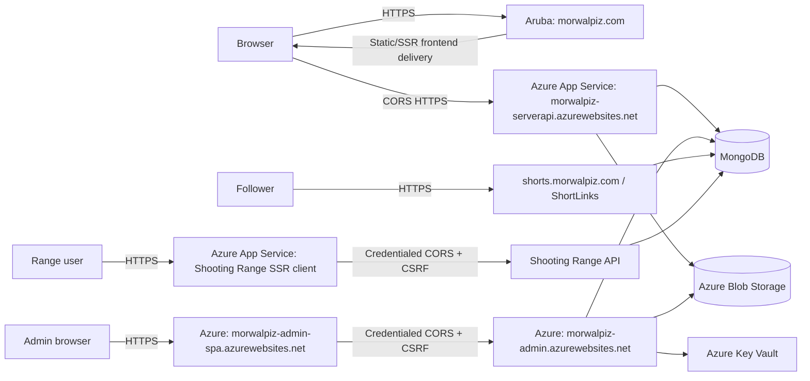

# Deployment Architecture

## Production Topology

There is no source-backed production reverse proxy from `morwalpiz.com` to ServerAPI. The browser calls Azure ServerAPI directly. Relative `/api` proxy behavior is local-development behavior only.

## Public Hosts

- `https://morwalpiz.com`: canonical public frontend on Aruba.
- `https://morwalpiz-serverapi.azurewebsites.net`: public API.
- `https://morwalpiz-admin-spa.azurewebsites.net`: BackOffice SPA.
- `https://morwalpiz-admin.azurewebsites.net`: BackOffice API; credentialed CORS accepts only the BackOffice SPA origin.
- `https://shorts.morwalpiz.com`: branded redirects.
- Shooting Range client and API hosts are environment-managed Azure App Services; the client receives the API origin through runtime `API_BASE_URL`.

The browser session between the admin SPA and BackOffice API is the Secure, HttpOnly `auth_token` cookie with `SameSite=None`; unsafe cookie requests carry the CSRF token from `/api/auth/csrf`. The SPA does not read `localStorage.authToken` or send a browser Bearer header. API-key headers remain supported for VideoImporter, InsightScanner, and other explicitly machine-authenticated callers.

Shooting Range is not publicly exposed yet but is expected to be soon. Its API and client workflows remain bound to the GitHub `production` environment. Before public exposure, the release must satisfy the authorization, CORS, CSRF, account-state, response-contract, MongoDB readiness, and booking-integrity gates in [Shooting Range Booking](../shooting-range-architecture.md).

The shop remains pre-production and on hold. Existing shop workflows or runtime artifacts do not imply approval to deploy or evolve it; deployment automation must be reviewed when the hold is eventually lifted.

Other Azure application names and custom bindings are environment-managed and must be inventoried before deployment changes.

## Local Orchestration

Aspire AppHost starts:

- ServerAPI, public client, and the on-hold shop client for local compatibility.
- BackOffice and BackOffice SPA.
- ShortLinks.
- Shooting Range API and client.

It does not provision MongoDB, Key Vault, Shooting ITA, or either WPF application. Developers supply those dependencies or use mocks/fakes.

Local development keeps the relative `/api` Vite proxy and Development credentialed CORS behavior. The production public frontend continues to call ServerAPI directly, while only the BackOffice SPA uses credentialed cross-origin calls to the BackOffice API.

## CI Baseline

Current CI builds six frontend applications, four backend hosts, and both Windows clients, and runs `MorWalPizVideo.BackOffice.Tests`. It does not build the on-hold shop client, AppHost, or `MorWalPizVideo.YouTubeUtilities.Tests`, and several frontend applications have little or no executable test coverage.

Required improvements for active surfaces:

- Keep shared frontend packages built in dependency order.
- Add the omitted active test projects and AppHost build verification.
- Require focused Shooting Range API authorization/integrity tests and non-empty client tests before its production deployment.
- Build Docker images for deployed active containers.
- Add secret scanning, dependency/security review, and documentation link validation.

The shop is intentionally excluded while on hold; omission from active CI is not a release defect until the hold is lifted.

## Container Baseline

API Dockerfiles currently use .NET 8/9 images while projects target .NET 10, and restore stages do not consistently copy all referenced project manifests. Align SDK/runtime images and restore inputs with project files.

Frontend containers use each application's established runtime/build-time configuration. The shop client's existing runtime injection is retained but receives no active evolution while the hold applies.

## Release Order

For cross-cutting changes:

1. Deploy backward-compatible Models/Domain/Contracts behavior.
2. Apply or verify Mongo indexes and production configuration separately; deployment workflows do not perform these operations.
3. Deploy the Shooting Range API and verify `/health` and `/health/ready`.
4. Before public exposure, verify deny-by-default authorization, the configured client origin, CSRF/login/session restoration, manually inserted administrator access, safe DTOs, and booking invariants.
5. Deploy the Shooting Range client with its immutable image SHA and verify runtime `API_BASE_URL` against the API.
6. Deploy other active frontend and desktop consumers.
7. Observe legacy route/data usage.
8. Remove compatibility paths only after a defined zero-use window.

## Health And Rollback

- Liveness checks process responsiveness only.
- Readiness checks critical stores required by that host.
- Optional external-provider failures are reported without necessarily failing liveness.
- Rollback artifacts and configuration are retained for every release.
- Shooting Range container images and API releases are addressed by immutable commit SHA; a previous SHA can be redeployed manually.
- Database changes are additive until rollback risk has passed.
- Blob migrations copy and checksum before switching references; old locations remain read-only during verification.

## Blob Deployment Policy

Configure `BlobStorage:Endpoint` to the Blob service HTTPS endpoint and keep `PreferManagedIdentity=true` in production. `DefaultAzureCredential` is used by the singleton service client. `BlobStorage:ConnectionString` remains an environment-managed local-development and rollback fallback; never store it in source or evidence.

For social asset SAS, configure the BackOffice managed identity with `Storage Blob Data Contributor` on the upload scope and `Storage Blob Delegator` at the storage-account scope. Also configure `BlobStorage:StorageAccountName`, `BlobStorage:SocialAssetContainerName`, and the existing SAS TTL settings. Managed identity uses User Delegation SAS and does not require `StorageAccountKey`; if the explicit Shared Key fallback is selected with `PreferManagedIdentity=false`, keep `StorageAccountKey` only in environment configuration or Key Vault and never log it.

Apply and independently verify these Azure controls before production sign-off:

- Keep match, sponsor, and page preview containers anonymously readable to preserve current direct public URLs.
- Keep originals/uploads and temporary administrative content private.
- Keep recovery private in a separate non-production account where practical, with operator-only access.
- Grant BackOffice Blob Data Contributor only on containers it writes and ServerAPI Blob Data Reader only on the match preview container it lists.
- Enable blob soft delete, container soft delete, and old-version retention for 30 days.
- Delete abandoned temporary and recovery artifacts after 7 days with lifecycle management.
- Prove restore by comparing SHA-256 before and after an authorized private-container restore.

Credential rotation is a separate administrator-owned change from destructive cleanup. Do not combine rotation, lifecycle deletion, or recovery-object cleanup in one irreversible deployment.

## Hangfire Activation

Hangfire is not part of the current deployment baseline and remains disabled through `FeatureManagement:EnableHangFire=false`. Checked-in configuration contains only empty `ConnectionStrings:HangfireConnection` and the existing `YouTubeSyncCron` schedule placeholder; secrets remain environment-managed. Enabling Hangfire outside Development without durable SQL configuration fails startup, and deployment automation must not provision or migrate that store implicitly.

Before activation, operators must approve and provision the SQL store, verify admin-only `/hangfire` access, review retries and idempotency for each recurring job, prove continuity across restart, and demonstrate exported structured job telemetry with agreed thresholds and alerts. Source-level logging and local tests do not satisfy those deployment gates. Record evidence through `operations/phase5-activation-and-recovery.md`.

## Operational Unknowns

The repository does not prove deployed Azure settings, custom-domain bindings, TLS certificates, active flags, Blob access levels, or externally created Mongo indexes. Deployment runbooks must inventory these before execution.