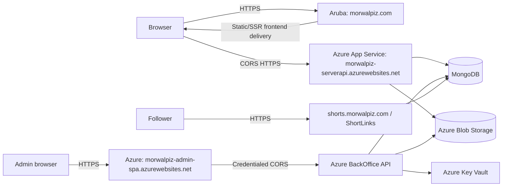

# Deployment Architecture

## Production Topology

There is no source-backed production reverse proxy from `morwalpiz.com` to ServerAPI. The browser calls Azure ServerAPI directly. Relative `/api` proxy behavior is local-development behavior only.

## Public Hosts

- `https://morwalpiz.com`: canonical public frontend on Aruba.
- `https://morwalpiz-serverapi.azurewebsites.net`: public API.
- `https://morwalpiz-admin-spa.azurewebsites.net`: BackOffice SPA.
- `https://shorts.morwalpiz.com`: branded redirects.

Other Azure application names and custom bindings are environment-managed and must be inventoried before deployment changes.

## Local Orchestration

Aspire AppHost starts:

- ServerAPI, public client, and shop client.
- BackOffice and BackOffice SPA.
- ShortLinks.

It does not provision MongoDB, Key Vault, Shooting ITA, or either WPF application. Developers supply those dependencies or use mocks/fakes.

## CI Baseline

Current CI builds only selected web projects and incorrectly checks for a root `tests` directory, so the actual backend tests are skipped.

Target CI matrix:

- .NET restore/build for all solution projects.
- BackOffice.Tests execution.
- Shared frontend packages in dependency order.
- BackOffice SPA, public client, shop, and Shooting ITA tests/builds.
- ShortLinks build and behavior tests.
- WPF builds on Windows.
- Docker builds for every deployed container.
- Secret scanning and dependency/security review.
- Documentation link and structure validation.

## Container Baseline

API Dockerfiles currently use .NET 8/9 images while projects target .NET 10, and restore stages do not consistently copy all referenced project manifests. Align SDK/runtime images and restore inputs with project files.

Frontend containers must use `VITE_API_BASE_URL` consistently. The shop client's Docker entrypoint and workflow have been aligned to this convention (`env-config.js`/`window.ENV`, same as `back-office-spa`).

## Release Order

For cross-cutting changes:

1. Deploy backward-compatible Models/Domain/Contracts behavior.
2. Deploy APIs with old and new routes/contracts active.
3. Apply idempotent data backfills and indexes.
4. Deploy frontend and desktop consumers.
5. Observe legacy route/data usage.
6. Remove compatibility paths only after a defined zero-use window.

## Health And Rollback

- Liveness checks process responsiveness only.
- Readiness checks critical stores required by that host.
- Optional external-provider failures are reported without necessarily failing liveness.
- Rollback artifacts and configuration are retained for every release.
- Database changes are additive until rollback risk has passed.
- Blob migrations copy and checksum before switching references; old locations remain read-only during verification.

## Operational Unknowns

The repository does not prove deployed Azure settings, custom-domain bindings, TLS certificates, active flags, Blob access levels, or externally created Mongo indexes. Deployment runbooks must inventory these before execution.