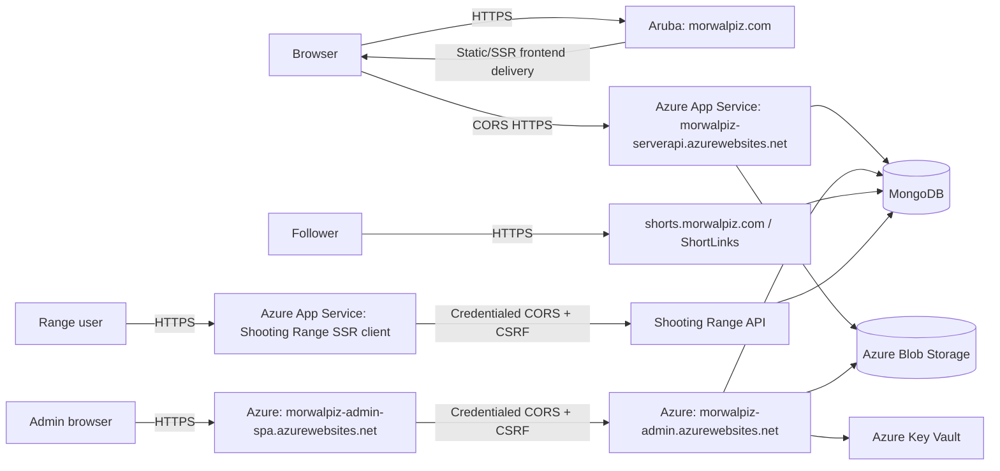

# Deployment Architecture

## Production Topology

```mermaid
flowchart LR
    Browser[Browser] -->|HTTPS| Aruba[Aruba: morwalpiz.com]
    Aruba -->|Static/SSR frontend delivery| Browser
    Browser -->|CORS HTTPS| API[Azure App Service: morwalpiz-serverapi.azurewebsites.net]
    Admin[Admin browser] -->|HTTPS| AdminSpa[Azure: morwalpiz-admin-spa.azurewebsites.net]
    AdminSpa -->|Credentialed CORS + CSRF| BO[Azure: morwalpiz-admin.azurewebsites.net]
    Shooter[Range user] -->|HTTPS| ShootingClient[Azure App Service: Shooting Range SSR client]
    ShootingClient -->|Credentialed CORS + CSRF| ShootingAPI[Shooting Range API]
    Follower[Follower] -->|HTTPS| Shorts[shorts.morwalpiz.com / ShortLinks]
    API --> Mongo[(MongoDB)]
    BO --> Mongo
    Shorts --> Mongo
    API --> Blob[(Azure Blob Storage)]
    BO --> Blob
    BO --> Vault[Azure Key Vault]
    ShootingAPI --> Mongo
```

There is no source-backed production reverse proxy from `morwalpiz.com` to ServerAPI. The browser calls Azure ServerAPI directly. Relative `/api` proxy behavior is local-development behavior only.

## Public Hosts

- `https://morwalpiz.com`: canonical public frontend on Aruba.
- `https://morwalpiz-serverapi.azurewebsites.net`: public API.
- `https://morwalpiz-admin-spa.azurewebsites.net`: BackOffice SPA.
- `https://morwalpiz-admin.azurewebsites.net`: BackOffice API; credentialed CORS accepts only the BackOffice SPA origin.
- `https://shorts.morwalpiz.com`: branded redirects.
- Shooting Range client and API hosts are environment-managed Azure App Services; the client receives the API origin through runtime `API_BASE_URL`.

The browser session between the admin SPA and BackOffice API is the Secure, HttpOnly `auth_token` cookie with `SameSite=None`; unsafe cookie requests carry the CSRF token from `/api/auth/csrf`. The SPA does not read `localStorage.authToken` or send a browser Bearer header. API-key headers remain supported for VideoImporter, InsightScanner, and other explicitly machine-authenticated callers.

Shooting Range is not publicly exposed yet but is expected to be soon. Its API and client workflows remain bound to the GitHub `production` environment. Before public exposure, the release must satisfy the authorization, CORS, CSRF, account-state, response-contract, MongoDB readiness, and booking-integrity gates in [Shooting Range Booking](../shooting-range-architecture.md).

The shop remains pre-production and on hold. Existing shop workflows or runtime artifacts do not imply approval to deploy or evolve it; deployment automation must be reviewed when the hold is eventually lifted.

Other Azure application names and custom bindings are environment-managed and must be inventoried before deployment changes.

## Local Orchestration

Aspire AppHost starts:

- ServerAPI, public client, and the on-hold shop client for local compatibility.
- BackOffice and BackOffice SPA.
- ShortLinks.
- Shooting Range API and client.

It does not provision MongoDB, Key Vault, Shooting ITA, or either WPF application. Developers supply those dependencies or use mocks/fakes.

Local development keeps the relative `/api` Vite proxy and Development credentialed CORS behavior. The production public frontend continues to call ServerAPI directly, while only the BackOffice SPA uses credentialed cross-origin calls to the BackOffice API.

## CI Baseline

Current central CI builds six active frontend applications (including their existing SSR builds), four backend hosts, both Windows clients, and Aspire AppHost. It executes the existing backend/YouTubeUtilities, seven frontend workspace suites and two Windows desktop suites, plus clean BackOffice/ServerAPI container builds. Shop is excluded while on hold. Jobs fail on errors; frontend/desktop test gates reject empty collections. Matrix `fail-fast: false` collects independent failures; it does not permit failure.

The BackOffice and ServerAPI deployment workflows run both backend test projects before their build, publish, and Azure deployment jobs. A failed test job prevents publish. The focused `CatalogAuthorizationTests` class now passes all 16 theory cases in `MorWalPizVideo.BackOffice.Tests`; broader baseline status requires separate validation.

Required improvements for active surfaces:

- Keep shared frontend packages built in dependency order.
- Keep AppHost build verification and the active backend test projects green.
- Keep BackOffice and ServerAPI deployments gated by `MorWalPizVideo.BackOffice.Tests` and `MorWalPizVideo.YouTubeUtilities.Tests`; their path filters include `MorWalPizVideo.YouTubeUtilities/**` so shared YouTube changes cannot publish without those tests passing.
- Require focused Shooting Range API authorization/integrity tests and non-empty client tests before its production deployment.
- Build Docker images for deployed active containers.
- Add secret scanning, dependency/security review, and documentation link validation.

### Delivery And Test Matrix

| Owner/surface | Central gate | Delivery gate | Local evidence 2026-10-01 |
|---|---|---|---|
| BackOffice, ServerAPI, ShortLinks, Range | .NET 10 Release builds; existing BackOffice.Tests | Existing backend test jobs; Range additionally requires disposable real Mongo before publish | Existing implementation evidence remains separately recorded; full backend suite not rerun for this documentation slice |
| YouTubeUtilities | Existing xUnit suite | Both publishing APIs retain tests and dependency path filters | Not rerun in this slice |
| AppHost | Existing .NET 10 build | Local orchestration, not a production deployable | Not rerun in this slice |
| Shared models/services/layout | `yarn --cwd frontend build:shared` in dependency order | Required before active frontend checks | PASS |
| Shared services | `yarn --cwd frontend workspace @morwalpizvideo/services test --passWithNoTests=false` | Admin/Ask/public-video workflows also execute this suite | PASS: 2 files, 18 tests; config collects `src/**/*.test.ts`, including transport tests |
| BackOffice SPA | `yarn --cwd frontend workspace back-office-spa test --passWithNoTests=false`; checked `build` | Test job and checked build required via `needs: test` before image/publish | Tests PASS: 63 files, 290 tests; full typecheck remains a failed gate, not replaced by `build-uncheck` |
| Ask | `yarn --cwd frontend workspace ask.client test --passWithNoTests=false`; `build:all` | Tests/shared transport/checked client+SSR build before Azure login | FAIL: 1 file, 2 passed/2 failed; existing SSR error-propagation failures |
| Public video | `yarn --cwd frontend workspace morwalpizvideo.client test --passWithNoTests=false`; `build:all` | Tests/shared transport/checked client+SSR build before Azure login | PASS: 1 file, 4 tests; legacy API-key lint gate remains failed separately |
| Shooting ITA | `yarn --cwd frontend workspace shooting-ita-frontend test --passWithNoTests=false`; `build:all` | No new deployment introduced | PASS: 12 files, 32 tests |
| Range client | `yarn --cwd frontend workspace shooting-range.client test --passWithNoTests=false`; `build:all` | Existing nonempty tests and checked client/SSR build before image push | PASS: 4 files, 26 tests; browser release evidence still BLOCKED |
| Shoot Recorder | `yarn --cwd frontend workspace shoot-recorder test --passWithNoTests=false`; checked `build` | No new deployment introduced | PASS: 6 files, 16 tests |
| InsightScanner.Tests | Windows only, xUnit 2/VSTest, Release/AnyCPU; TRX executed count must be positive | No desktop deployment introduced | FAIL: 3 passed/1 failed/0 skipped; fake DTO equality |
| VideoImporter.Tests | Windows only, xUnit 2/VSTest, Release/AnyCPU; TRX executed count must be positive | No desktop deployment introduced | FAIL: 8 passed/1 failed/0 skipped; `PendingModelChangesWarning`, no schema changes/suppression |
| BackOffice/ServerAPI containers | `docker build --no-cache --file <project>/Dockerfile .` | Existing Dockerfiles preserve transitive manifests | Static closure/.NET 10 check PASS; clean execution NOT RUN: local Docker daemon unavailable |
| Shop and standalone utilities | No test expansion or new gate | Frozen/out of scope | NOT RUN; historical shop Sass failure is not fixed or bypassed |

The frontend counts above are fresh local Windows runner results, not GitHub/Linux results or browser proof. Desktop commands were `dotnet test <project>/<project>.csproj --configuration Release -p:Platform=AnyCPU --logger trx --results-directory <temporary-directory>`; editor test discovery found no tests, so the actual VSTest runners were used. Local SDK is `10.0.400-preview.0.26322.102`; CI selects `10.0.x`. CI restores first and uses `--no-restore`. Failed gates stay failed. See [transport isolation](transport-isolation.md) and [Windows applications](windows-apps.md) for earlier build/typecheck/lint evidence. Deployment workflow path filters include workspace manifests/lockfile; Range API includes YouTubeUtilities because its test restore transitively references it. No shop workflow changed.

Additional fresh checks: `yarn --cwd frontend/back-office-spa tsc -b --pretty false` FAILS with the same eight unrelated Toast/product/sponsor errors. `yarn --cwd frontend/morwalpizvideo.client eslint src/services/apiKeys.ts` FAILS with seven existing `no-explicit-any` errors. No errors were suppressed or fixed outside scope. Desktop TRX counters confirm 4 and 9 executed tests. Parsed YAML validates changed workflow paths, runners and test/build ordering before cloud steps; no GitHub jobs were executed locally. Across the seven frontend and two desktop suites: 399 passed, 4 failed, 0 skipped; this is not a green release gate. Lint remains a required release-review check even where a legacy workflow does not automate it; no all-green deployment certification is claimed.

## Container Baseline

BackOffice and ServerAPI Dockerfiles use SDK/runtime .NET 10 and copy Contracts, Domain, Models, MvcHelpers, ServiceDefaults and the transitive YouTubeUtilities manifest before restore. This corrects the former missing restore input. Source inspection and local builds do not prove clean Docker execution; the new clean-container CI jobs must pass. Credential context/publish exclusions do not invalidate historical artifacts; operator review remains required.

Frontend containers use each application's established runtime/build-time configuration. The shop client's existing runtime injection is retained but receives no active evolution while the hold applies.

## Release Order

For cross-cutting changes:

1. Deploy backward-compatible Models/Domain/Contracts behavior.
2. Apply or verify Mongo indexes and production configuration separately; deployment workflows do not perform these operations.
3. Deploy the Shooting Range API and verify `/health` and `/health/ready`.
4. Before public exposure, verify deny-by-default authorization, the configured client origin, CSRF/login/session restoration, manually inserted administrator access, safe DTOs, and booking invariants.
5. Deploy the Shooting Range client with its immutable image SHA and verify runtime `API_BASE_URL` against the API.
6. Deploy other active frontend and desktop consumers.
7. Observe legacy route/data usage.
8. Remove compatibility paths only after a defined zero-use window.

## Health And Rollback

- Liveness checks process responsiveness only.
- Readiness checks critical stores required by that host.
- Optional external-provider failures are reported without necessarily failing liveness.
- Rollback artifacts and configuration are retained for every release.
- Shooting Range container images and API releases are addressed by immutable commit SHA; a previous SHA can be redeployed manually.
- Database changes are additive until rollback risk has passed.
- Blob migrations copy and checksum before switching references; old locations remain read-only during verification.

## Blob Deployment Policy

Configure `BlobStorage:Endpoint` to the Blob service HTTPS endpoint and keep `PreferManagedIdentity=true` in production. `DefaultAzureCredential` is used by the singleton service client. `BlobStorage:ConnectionString` remains an environment-managed local-development and rollback fallback; never store it in source or evidence.

For social asset SAS, configure the BackOffice managed identity with `Storage Blob Data Contributor` on the upload scope and `Storage Blob Delegator` at the storage-account scope. Also configure `BlobStorage:StorageAccountName`, `BlobStorage:SocialAssetContainerName`, and the existing SAS TTL settings. Managed identity uses User Delegation SAS and does not require `StorageAccountKey`; if the explicit Shared Key fallback is selected with `PreferManagedIdentity=false`, keep `StorageAccountKey` only in environment configuration or Key Vault and never log it.

Apply and independently verify these Azure controls before production sign-off:

- Keep match, sponsor, and page preview containers anonymously readable to preserve current direct public URLs.
- Keep originals/uploads and temporary administrative content private.
- Keep recovery private in a separate non-production account where practical, with operator-only access.
- Grant BackOffice Blob Data Contributor only on containers it writes and ServerAPI Blob Data Reader only on the match preview container it lists.
- Enable blob soft delete, container soft delete, and old-version retention for 30 days.
- Delete abandoned temporary and recovery artifacts after 7 days with lifecycle management.
- Prove restore by comparing SHA-256 before and after an authorized private-container restore.

Credential rotation is a separate administrator-owned change from destructive cleanup. Do not combine rotation, lifecycle deletion, or recovery-object cleanup in one irreversible deployment.

## Hangfire Activation

Checked-in BackOffice configuration enables `FeatureManagement:EnableHangFire=true` but leaves `ConnectionStrings:HangfireConnection` empty. Startup fails until durable SQL is supplied through protected configuration; this is not proof that deployed Hangfire is active or disabled. Deployment automation must not provision or migrate the store implicitly. Preserve existing `YouTubeSyncCron` and recurring IDs.

Before activation, operators must approve and provision the SQL store, verify admin-only `/hangfire` access, review retries and idempotency for each recurring job, prove continuity across restart, and demonstrate exported structured job telemetry with agreed thresholds and alerts. Source-level logging and local tests do not satisfy those deployment gates. Record evidence through `operations/phase5-activation-and-recovery.md`.

## Operational Unknowns

The repository does not prove deployed Azure settings, custom-domain bindings, TLS certificates, active flags, Blob access levels, or externally created Mongo indexes. Deployment runbooks must inventory these before execution. The [release evidence checklist](operations/phase5-activation-and-recovery.md#release-evidence-checklist-2026-10-01) is BLOCKED until independent artifacts and approvals exist; completing docs/CI authoring is not production approval.