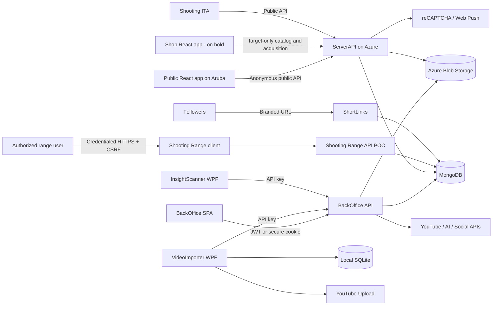
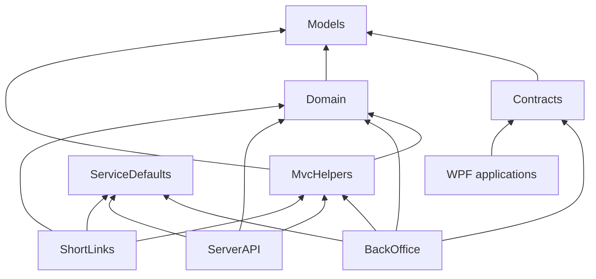

# Architecture Overview

## Purpose

MorWalPizVideo is a multi-application content-management and publishing system centered on BackOffice. It manages video-oriented content, channels, categories, compilations, short links, sponsors, forms, publishing schedules, social integrations, and insight workflows. Public applications consume selected projections through ServerAPI. Shop capabilities exist as pre-production code but are on hold. Shooting Range is an independent, minimal POC rather than part of the core publishing domain.

## System Context

## Architectural Planes

### Management Plane

`MorWalPizVideo.BackOffice` and `frontend/back-office-spa` own authenticated administrative workflows. This includes core-entity mutation, imports, uploads, publishing, configuration, integrations, user/API-key management, jobs, and cache coordination.

### Public Plane

`MorWalPizVideo.ServerAPI` exposes public projections and explicitly approved public interactions, such as form responses and sponsorship applications. Pre-production public catalog and free-artifact code remains present but on hold. ServerAPI must not provide administrative writes for videos, channels, categories, compilations, playlists, or equivalent core content.

### Redirect Plane

`MorWalPizVideo.ShortLinks` resolves branded short codes and records usage. It remains independent of media delivery and administrative management.

### Shooting Range POC

`MorWalPizVideo.ShootingRange` and `frontend/shooting-range.client` form a self-contained booking POC. The API references ServiceDefaults but does not depend on the publishing Domain, Models, Contracts, MvcHelpers, or BackOffice projects. Every domain operation is targeted to require authorization; login, CSRF token acquisition, and health probes are the only anonymous technical exceptions.

The POC remains deliberately small. The first administrator is inserted manually into MongoDB, ordinary-user onboarding is not yet final, and admin-created users are the working assumption. See [Shooting Range Booking](../shooting-range-architecture.md).

### Local Operations Plane

VideoImporter supports local upload and scheduling workflows with SQLite tenant state. InsightScanner collects and submits insight data. Both use BackOffice service-to-service authentication and must remain deployable independently of web clients.

## Dependency Direction

API hosts compose shared libraries; they do not reference each other. Cross-service communication uses HTTP and shared contracts rather than project references.

## Principal Data Flows

### Administrative Mutation

1. BackOffice SPA submits an authenticated DTO.
2. BackOffice controller validates the request and invokes the owning service/repository.
3. MongoDB or Blob Storage is updated.
4. BackOffice invalidates affected ServerAPI cache tags through an authenticated internal contract.
5. Public clients receive the new projection on their next request.

### Public Read

1. A public application calls ServerAPI.
2. ServerAPI queries a focused repository or projection service.
3. Output caching may serve or retain the response.
4. Persistence entities are mapped to public DTOs before returning.

### Free Digital Artifact (Target, On Hold)

This flow is an accepted future design for the pre-production shop. It is not active roadmap work.

1. ServerAPI returns an anonymous catalog DTO containing a public preview URL but no storage key.
2. ServerAPI creates or resumes a server-owned anonymous cart using an opaque HttpOnly cookie.
3. Adding an artifact records a durable free acquisition for that anonymous cart.
4. A download request verifies the acquisition and returns a short-lived read-only Blob SAS URL.
5. A future customer account may claim anonymous acquisitions; product identity and free status never change.

### Short Link

1. BackOffice creates a globally unique normalized code and validated destination.
2. A follower visits `https://shorts.morwalpiz.com/{code}`.
3. ShortLinks resolves one canonical record, atomically increments the total, records an optional visit event, and redirects.

## Guiding Constraints

- Preserve public contracts and persisted data through additive migrations.
- Prefer focused feature services over the broad `DataService` facade.
- Use DTOs at every API boundary.
- Keep all cache tags lowercase invariant and centralized.
- Use `IHttpClientFactory` and named clients for server and desktop HTTP traffic.
- Keep external credentials in managed configuration, never source or documentation.
- Treat current runtime source as stronger evidence than plans and historical documents.

## Known Gaps

Current source does not yet fully implement versioned APIs or uniform DTO and Problem Details boundaries. Shooting Range still requires its public-release authorization, CORS, response-projection, account-lifecycle, and booking-integrity gates. Shop gaps remain recorded but inactive while the portfolio hold applies. See [Technical Debt](technical-debt.md) and [Refactoring Roadmap](refactoring-roadmap.md).