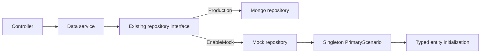
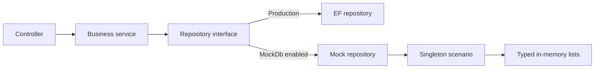
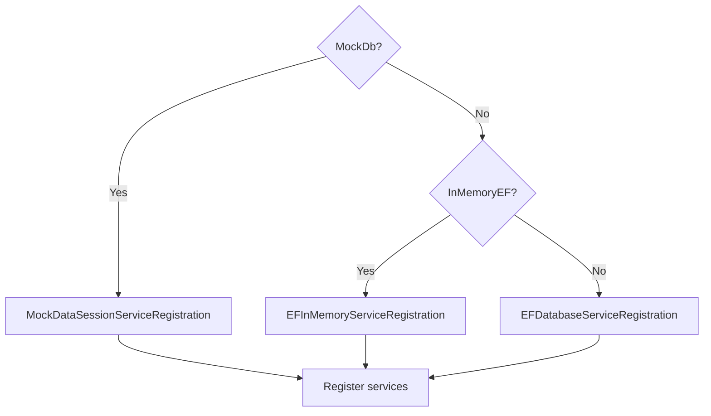
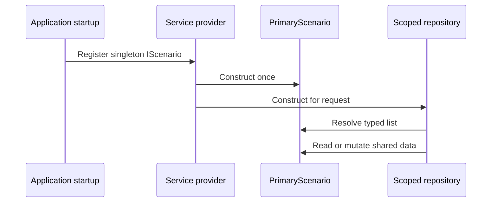

# Mock and Scenario Architecture

## MorWalPizVideo Implementation

MorWalPizVideo uses the same repository replacement pattern with MongoDB as the production provider and a validated, code-initialized scenario as the mock provider:



The implementation is shared by BackOffice, ServerAPI, and ShortLinks:

- `PrimaryScenario` initializes the canonical entity graph directly in C#.
- `BaseScenario` owns reset, detached cloning, and in-memory CRUD behavior.
- Scenario data uses synthetic identities and credentials; no fixture files are copied to publish output.
- `BaseMockRepository<T>` preserves the existing `IRepository<T>` contract and returns detached snapshots so mutations require `UpdateItemAsync`.
- One scenario singleton is created per host process. BackOffice and ServerAPI start from identical data but do not share runtime mutations.
- Mock mode is rejected outside Development and Test environments.

### Canonical Relationship Validation

Scenario construction fails when canonical data violates these rules:

- collection IDs are present and unique;
- category snapshots reference an existing category and use its current title;
- `CalendarEvent.MatchId` references `YouTubeContent.Id` when populated;
- compilation and channel videos reference existing YouTube video IDs;
- short-link codes are unique across standalone, match, and channel sources;
- exactly one active `MorWalPiz` user is configured as `admin` with BackOffice access.

Every registered repository collection is initialized explicitly. The connected baseline uses deterministic Mongo-compatible IDs for categories, matches, videos, channels, short links, and the MorWalPiz administrator; unused collections start as typed empty arrays.

### Test Lifecycle

`BackOfficeWebApplicationFactory` resolves the repositories created by the real host. A Reqnroll `BeforeScenario` hook calls `IMockScenario.Reset()`, which reconstructs the typed baseline in fresh in-memory state. Tests can arrange through repositories without leaking changes into later scenarios.

Dedicated factories verify that ServerAPI and ShortLinks start with the same provider and serve the connected baseline.

## Purpose

This document explains how the Rancher Management Dashboard implements deterministic mock data and in-memory repositories. It is intended as a reference for reproducing the same pattern in another ASP.NET Core application.

The pattern replaces the data-access layer without changing controllers or business services:



## Project Structure

The implementation is split by responsibility:

| Project or area | Responsibility |
|---|---|
| `Rancher.Management.Dashboard.Models` | Domain entities stored by repositories |
| `Rancher.Management.Dashboard.BL` | Repository interfaces and the `IScenario` contract |
| `Rancher.Management.Dashboard.DAL.EF` | Production EF Core repository implementations |
| `Rancher.Management.Dashboard.DAL.Mocks` | Scenario data and mock repository implementations |
| `Rancher.Management.Dashboard/Services/DataSession` | Dependency-injection registration for each data provider |
| `Rancher.Management.Dashboard.Tests` | Test bootstrap that creates a fresh scenario for each test |

Important implementation files:

- [`IScenario.cs`](../src/Rancher.Management.Dashboard.BL/Data/Scenarios/IScenario.cs) defines every scenario collection.
- [`BaseScenario.cs`](../src/Rancher.Management.Dashboard.DAL.Mocks/Scenarios/BaseScenario.cs) initializes all collections as empty lists.
- [`PrimaryScenario.cs`](../src/Rancher.Management.Dashboard.DAL.Mocks/Scenarios/PrimaryScenario.cs) creates the connected sample data graph.
- [`RepositoryMockStructure.cs`](../src/Rancher.Management.Dashboard.DAL.Mocks/Data/Common/RepositoryMockStructure.cs) implements common in-memory CRUD behavior.
- [`RepositoryMockBase.cs`](../src/Rancher.Management.Dashboard.DAL.Mocks/Data/Common/RepositoryMockBase.cs) specializes the generic repository for `IScenario`.
- [`MockDataSessionServiceRegistration.cs`](../src/Rancher.Management.Dashboard/Services/DataSession/MockDataSessionServiceRegistration.cs) maps repository interfaces to mock implementations.
- [`Program.cs`](../src/Rancher.Management.Dashboard/Program.cs) selects the active data provider.
- [`ApiControllerTestsBase.cs`](../src/Rancher.Management.Dashboard.Tests/Controllers/Common/ApiControllerTestsBase.cs) builds an isolated mock container for each test.

## Core Components

### 1. Scenario Contract

`IScenario` is a typed catalog of all data sets required by the application. Each entity type has an `IList<T>` property:

```csharp
public interface IScenario : IBaseScenario
{
    IList<User> Users { get; set; }
    IList<Group> Groups { get; set; }
    IList<GroupUser> GroupUsers { get; set; }
}
```

The interface lets repositories consume a scenario without knowing which concrete scenario supplied the data. `IBaseScenario` is a marker used by the generic mock repository implementation.

### 2. Base Scenario

`BaseScenario` implements the contract and initializes every collection. This guarantees that a repository always receives a non-null list, even when a concrete scenario has no fixtures for that entity.

```csharp
public abstract class BaseScenario : IScenario
{
    public IList<User> Users { get; set; } = [];
    public IList<Group> Groups { get; set; } = [];
    public IList<GroupUser> GroupUsers { get; set; } = [];
}
```

Shared constants, such as environment names, also live in this class.

### 3. Concrete Scenario

`PrimaryScenario` populates the lists in its constructor. It represents a coherent application state rather than unrelated fixtures. IDs connect records in the same way foreign keys do in the production database:

```csharp
public sealed class PrimaryScenario : BaseScenario
{
    public PrimaryScenario()
    {
        Users =
        [
            new User { Id = "user-1", Username = "admin@example.com" }
        ];

        Groups =
        [
            new Group { Id = "group-1", Name = "Administrators" }
        ];

        GroupUsers =
        [
            new GroupUser
            {
                Id = "group-user-1",
                UserId = "user-1",
                GroupId = "group-1"
            }
        ];
    }
}
```

Stable, explicit IDs make relationships readable and tests deterministic. Time-sensitive records in the current scenario commonly use values relative to `DateTime.UtcNow`.

### 4. Generic Mock Repository

`RepositoryMockStructure<T, TScenario>` implements the same `IRepositoryBase<T>` used by EF repositories. Its constructor receives the scenario and a resolver that selects the correct list:

```csharp
public class RepositoryMockStructure<T, TScenario> : IRepositoryBase<T>
    where T : EntityBase, new()
    where TScenario : IBaseScenario
{
    private readonly IList<T> _entities;

    public RepositoryMockStructure(
        TScenario scenario,
        Func<TScenario, IList<T>> entitiesResolver)
    {
        _entities = entitiesResolver(scenario);
    }
}
```

The common implementation provides:

- `Add` and `AddRange`, generating a GUID when an ID is missing.
- `Update`, replacing the item with the same ID.
- `Delete`, removing the item with the same ID.
- `Fetch`, with expression filtering, ordering, paging, and materialization to a new list.
- `Single`, using `SingleOrDefault` against the in-memory collection.
- `Validate`, currently returning no validation errors.
- Completed tasks for writes so the API remains compatible with asynchronous production repositories.

The returned entity objects are not cloned. A caller can mutate a fetched entity because it is still the same reference held by the scenario.

### 5. Entity-Specific Repository

Most mock repositories contain only the mapping from an entity to its scenario collection:

```csharp
public sealed class UserMockRepository
    : RepositoryMockBase<User>, IUserRepository
{
    public UserMockRepository(IScenario scenario)
        : base(scenario, current => current.Users)
    {
    }
}
```

This keeps controllers and business services unaware of whether data comes from EF Core or from a scenario.

Specialized repositories are appropriate when multiple entity subtypes share one collection. For example, typed support-ticket repositories query `IScenario.SupportTickets` through `OfType<T>()` so writes remain visible through both base and derived repository interfaces.

## Dependency Injection and Runtime Selection

The application selects one complete set of repository implementations at startup.



The selection in `Program.cs` is conceptually:

```csharp
IDataSessionServiceRegistration registration;

if (mockDb)
    registration = new MockDataSessionServiceRegistration();
else if (inMemoryEf)
    registration = new EFInMemoryServiceRegistration();
else
    registration = new EFDatabaseServiceRegistration(connectionString);

registration.RegisterServices(builder.Services);
```

`MockDataSessionServiceRegistration` uses these lifetimes:

```csharp
services.AddSingleton<IScenario, PrimaryScenario>();
services.AddScoped<IUserRepository, UserMockRepository>();
services.AddScoped<IGroupRepository, GroupMockRepository>();
```

The lifetime choices are significant:

- One `PrimaryScenario` is created for the service provider.
- All request-scoped repositories resolve lists from that same scenario.
- Writes are visible to later repository instances and later HTTP requests.
- Data lasts until the application service provider is disposed or the app restarts.
- The lists are ordinary `List<T>` instances and are not safe for concurrent writes.

Development settings enable this path with `FeatureManagement:MockDb`. The application also has separate flags for concerns that are independent from repository data:

- `MockUsers` replaces authentication/user lookup behavior.
- `MockServices` replaces external integrations such as Rancher, Azure DevOps, email, and blob storage.
- `MockKeyVault` replaces Key Vault access.
- `InMemoryEF` uses EF Core's in-memory provider and seeds part of `PrimaryScenario`; it is not the same as `MockDb`.

When both `MockDb` and `InMemoryEF` are enabled, `MockDb` wins because it is checked first.

## Request and Test Lifecycles

### Development Application



The scenario behaves like a small process-local database. Restarting the application resets it.

### Unit Tests

`ApiControllerTestsBase<TController, TScenario>` creates a new `ServiceCollection` during each MSTest `[TestInitialize]`, registers the mock data session, and builds a new service provider. Therefore:

- each test gets a newly constructed `PrimaryScenario`;
- mutations made by one test do not leak into another test;
- the controller, services, and repositories use the same scenario within one test;
- tests can access `Scenario` directly to arrange data or assert stored state;
- the base class installs a mock authenticated user in the controller's `HttpContext`.

A typical test follows this shape:

```csharp
[TestClass]
public sealed class UsersControllerTests
    : ApiControllerTestsBase<UsersController, PrimaryScenario>
{
    protected override User GetIdentityUser() => GetAdminUser();

    [TestMethod]
    public async Task Create_adds_user_to_scenario()
    {
        var result = await Controller.Create(new CreateUserRequest
        {
            Username = "new.user@example.com"
        });

        ParseExpectedCreated<UserResponse>(result);
        Assert.IsTrue(Scenario.Users.Any(x =>
            x.Username == "new.user@example.com"));
    }
}
```

## Reproducing the Pattern

Use these steps in the target application.

### Step 1: Preserve Repository Abstraction

Business services must depend on repository interfaces, never directly on `DbContext`:

```csharp
public interface IRepository<T> where T : EntityBase
{
    Task Add(T entity);
    Task Update(T entity);
    Task Delete(T entity);
    IReadOnlyList<T> Fetch(Expression<Func<T, bool>>? filter = null);
    T? Single(Expression<Func<T, bool>> filter);
}
```

Production and mock repositories must implement the same contracts.

### Step 2: Define the Scenario Contract

Add one collection for each repository-backed entity:

```csharp
public interface IScenario
{
    IList<Customer> Customers { get; }
    IList<Order> Orders { get; }
}
```

Prefer read-only collection properties when callers do not need to replace entire lists.

### Step 3: Add a Base Scenario

Initialize every collection to prevent null handling in repositories:

```csharp
public abstract class ScenarioBase : IScenario
{
    public IList<Customer> Customers { get; } = [];
    public IList<Order> Orders { get; } = [];
}
```

### Step 4: Create a Coherent Primary Scenario

Populate parent entities before relationship entities, use stable IDs, and keep all references valid:

```csharp
public sealed class PrimaryScenario : ScenarioBase
{
    public PrimaryScenario()
    {
        Customers.Add(new Customer { Id = "customer-1", Name = "Example" });
        Orders.Add(new Order
        {
            Id = "order-1",
            CustomerId = "customer-1",
            Number = "ORD-001"
        });
    }
}
```

For large domains, split fixture construction into private methods or domain-specific scenario builders instead of maintaining one very large constructor.

### Step 5: Implement One Generic Mock Repository

Use a collection resolver so entity-specific repositories remain trivial:

```csharp
public abstract class ScenarioRepository<T> : IRepository<T>
    where T : EntityBase
{
    private readonly IList<T> _entities;

    protected ScenarioRepository(
        IScenario scenario,
        Func<IScenario, IList<T>> resolver)
    {
        _entities = resolver(scenario);
    }

    public Task Add(T entity)
    {
        entity.Id ??= Guid.NewGuid().ToString();
        _entities.Add(entity);
        return Task.CompletedTask;
    }

    // Implement the remaining IRepository<T> members here.
}
```

### Step 6: Add Thin Entity Repositories

```csharp
public sealed class CustomerMockRepository
    : ScenarioRepository<Customer>, ICustomerRepository
{
    public CustomerMockRepository(IScenario scenario)
        : base(scenario, current => current.Customers)
    {
    }
}
```

### Step 7: Group DI Registration

Keep provider registration behind one abstraction so startup selects a complete, internally consistent data layer:

```csharp
public static IServiceCollection AddScenarioData(this IServiceCollection services)
{
    services.AddSingleton<IScenario, PrimaryScenario>();
    services.AddScoped<ICustomerRepository, CustomerMockRepository>();
    services.AddScoped<IOrderRepository, OrderMockRepository>();
    return services;
}
```

Select it from configuration and reject mock mode in production:

```csharp
var useMockData = builder.Configuration.GetValue<bool>("Features:MockData");

if (useMockData)
{
    if (!builder.Environment.IsDevelopment() &&
        !builder.Environment.IsEnvironment("Testing"))
    {
        throw new InvalidOperationException(
            "Mock data is allowed only in Development or Testing.");
    }

    builder.Services.AddScenarioData();
}
else
{
    builder.Services.AddEfData(builder.Configuration);
}
```

### Step 8: Isolate Every Test

Build a fresh service provider or scenario for each test. Do not share a mutable singleton through a test assembly fixture unless tests explicitly reset it.

```csharp
[TestInitialize]
public void Initialize()
{
    var services = new ServiceCollection();
    services.AddScenarioData();
    _provider = services.BuildServiceProvider();
    Scenario = _provider.GetRequiredService<IScenario>();
}
```

Dispose the provider in test cleanup when it owns disposable services.

## Adding a New Entity

When the target application gains a new repository-backed entity, update all of these pieces:

1. Add `IList<NewEntity>` to `IScenario`.
2. Initialize it in `ScenarioBase`.
3. Add connected fixture records to `PrimaryScenario` if needed.
4. Create `NewEntityMockRepository` using the collection resolver.
5. Register `INewEntityRepository` in the mock DI module.
6. Add tests for read, create, update, delete, missing-ID behavior, and test isolation.
7. Verify that fixture IDs and relationship IDs are unique and valid.

## Behavioral Differences and Improvements

The current application pattern is useful, but copying it literally would also copy several limitations.

### Validation

The mock repository's `Validate` method always returns an empty list. EF and application validation may reject data that mock mode accepts. The target implementation should run `Validator.TryValidateObject` or share the same validation component used in production.

### Tracking and Object References

EF repositories query with `AsNoTracking`, while mock repositories return references to objects stored in the scenario. Mutating a fetched object can therefore change mock state without calling `Update`. Clone results or use immutable records when production parity matters.

### Paging Order

The current mock repository applies `Take` before `Skip`; the EF repository applies `Skip` before `Take`. Reproduce the EF order in the new application:

```csharp
if (skip.HasValue) query = query.Skip(skip.Value);
if (take.HasValue) query = query.Take(take.Value);
```

### Concurrency

The singleton scenario uses mutable lists without synchronization. Concurrent HTTP writes can race with reads or other writes. Suitable alternatives are:

- restrict scenario mode to local development and tests;
- register a scoped scenario when persistence between requests is unnecessary;
- protect mutations with locks;
- use EF Core's in-memory provider when realistic concurrent behavior is required.

### Scenario Validation

`BaseScenario.ValidateUniqueIds` currently looks specifically for properties declared as `List<T>`, while scenario properties are declared as `IList<T>`. It therefore does not reliably inspect the current collections. In the target application, validate any property assignable to `IEnumerable<EntityBase>` and invoke validation after construction.

Also validate relationship integrity, not only duplicate IDs. For example, every `Order.CustomerId` should identify an existing customer.

### Time Determinism

Relative `DateTime.UtcNow` fixtures make data realistic but can make boundary tests unstable. Inject a `TimeProvider` or use fixed UTC timestamps in scenarios whose behavior depends on exact dates.

### Production Safety

Mock data, mock authentication, and mock external services should each have an explicit environment guard. A configuration mistake must not allow any mock provider to run in production.

## Choosing MockDb or EF In-Memory

Use scenario-backed mock repositories when:

- tests focus on controller or business behavior;
- deterministic, readable fixture graphs are important;
- fast setup matters more than EF query fidelity;
- tests need direct access to stored state.

Use EF Core in-memory or SQLite in-memory when:

- LINQ translation and EF behavior are part of the test;
- change tracking, constraints, or transactions matter;
- repository implementation itself is under test.

SQLite in-memory generally provides better relational fidelity than EF Core's in-memory provider. Neither option replaces integration tests against the production database engine for database-specific behavior.

## Summary

The essential pattern is:

1. Define one typed scenario contract containing all entity collections.
2. Populate a coherent concrete scenario with stable IDs and relationships.
3. Implement repository interfaces over scenario lists through one generic base class.
4. Swap the entire repository set through dependency injection.
5. Use a shared scenario for a local mock application and a fresh scenario per test.
6. Keep external-service mocks and authentication mocks separate from mock database selection.
7. Test mock/production parity for validation, paging, tracking, and failure behavior.